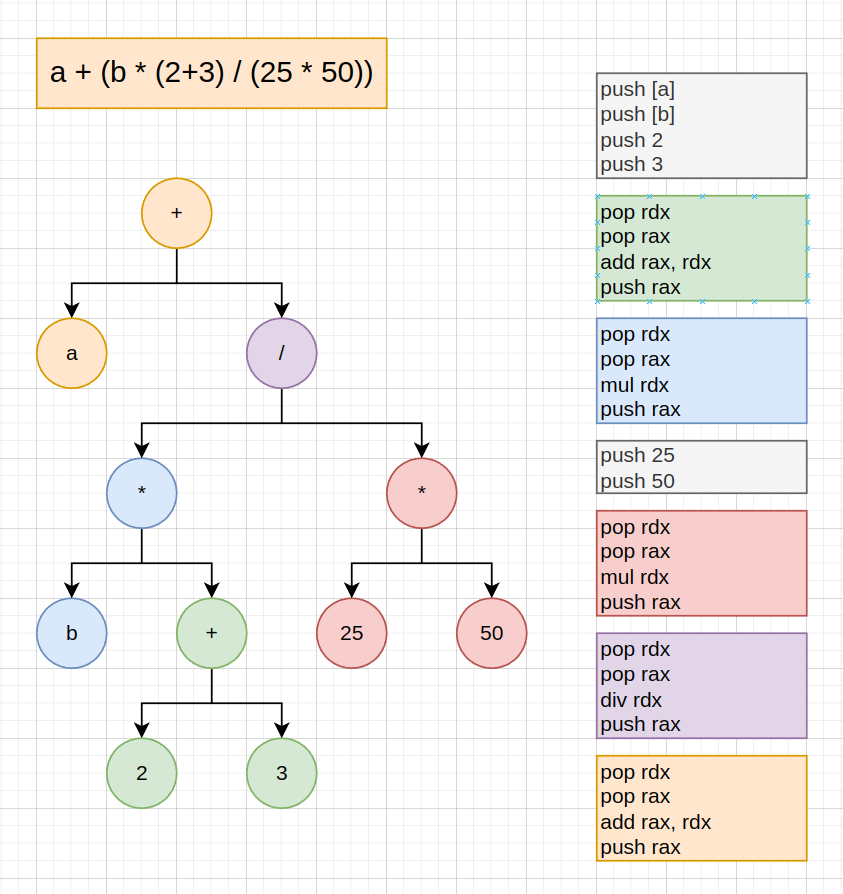

# Low Level C-like Language (LLCL) Compiler

## Why?
This is a learning project, not intended for professional use.

## About LLCL
LLCL is a very low level (lower than C) programming language:

- No built in memory allocation. At runtime a 100MB block of memory called MEMBLOCK is allocated. All dynamic memory allocation happens within MEMBLOCK and is written by the developer.

- No pointer type. All pointers are simply 64-bit integers (`i64`) used to index into MEMBLOCK.
The naming convention for pointers is to prefix them with "p_" for "pointer". Double pointers are prefixed with "pp_", triple pointers with "ppp_" and so on.

- No structs/classes.

- The built in datatypes are:
    - `u00` - unsigned 0-bit integer (void)
    - `u08`, `u16`, `u32`, `u64` - unsigned 8, 16, 32 and 64-bit integers.
    - `i08`, `i16`, `i32`, `i64` - signed 8, 16, 32 and 64-bit integers.
    - `f32`, `f64` - 32 and 64-bit floating point.

## Lexer
In this section I document the process of developing the LLCL Lexer.

## Parser
In this section I document the process of developing the LLCL Parser.

- Recursively parse expressions, generating a binary tree.
- Generate x86_64 NASM by performing a post-order traversal of the tree.

    </img>
    
Using a parse tree to generate assembly from "a + ((b * (2+3)) / (25*50))"

    
The final result is stored at the top of the stack

